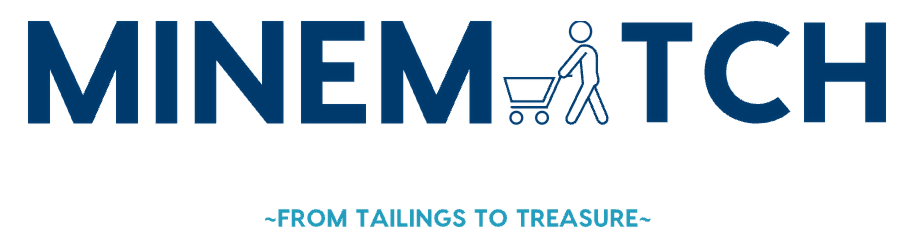

# Mine Match by Circular Miners
<p align='center'>
  
</p>
<p align='center'>
<a href="https://stirring-monstera-d635e6.netlify.app/">Live Application</a>
</p>

## How to run the application on your local

> Mine Match requires Node >=14.18

If you want to run the Backend on your local please visit <a href="https://github.com/CircularMiners/backend">Backend Repo</a> and follow the instruction there 
<mark>!!! Please note that you will have to change the Backend url from https://urchin-app-q36en.ondigitalocean.app/backend2 by Search through the whole project and "Replace All" with your Backend url <mark>
### Clone to local

```bash
cd frontend
pnpm i # If you don't have pnpm installed, run: npm install -g pnpm
```
### Development

Just run and visit http://localhost:3333

```bash
pnpm dev
```

### Build

To build the App, run

```bash
pnpm build
```

And you will see the generated file in `dist` that ready to be served.

### Deploy your version on Netlify

Go to [Netlify](https://app.netlify.com/start) and select your clone, `OK` along the way, and your App will be live in a minute.

### Docker Production Build

First, build the Mine Match image by opening the terminal in the project's root directory.

```bash
docker buildx build . -t minematch:latest
```

Run the image and specify port mapping with the `-p` flag.

```bash
docker run --rm -it -p 8080:80 minematch:latest
```

### This application use Opinionated Vite Starter Template by Anthony Fu Lookout for more here => <a href="https://github.com/antfu/vitesse">Vitesse</a>